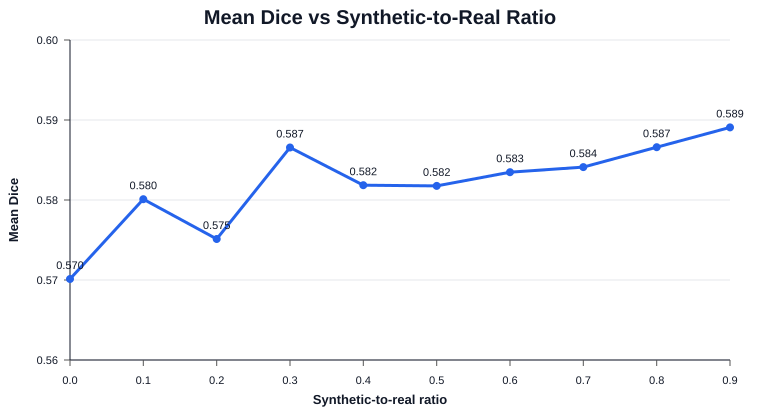

# Diffusion-Based Synthetic MRI Augmentation for 3D Brain Lesion Segmentation

Evaluate how diffusion-generated synthetic MRI data affects downstream 3D lesion segmentation. The workflow builds fixed data splits, mixes real and synthetic samples, trains a 3D U-Net, and summarizes performance across synthetic-to-real ratios.

## Highlights

- Built a 3D U-Net lesion segmentation pipeline with fixed train/validation splits, checkpointing, metric logging, and evaluation scripts.
- Mixed real ATLAS MRI cases with synthetic samples generated externally by the [USB](https://github.com/jhuldr/USB.git) pipeline.
- Evaluated synthetic-to-real ratios from `0.0` to `0.9` across existing split and generation seeds.

## Key Result

Existing experiments show modest average gains from synthetic augmentation over the real-only baseline. The results suggest that the synthetic-to-real ratio should be tuned and evaluated systematically rather than maximized blindly.
<!-- 
| Synthetic ratio | Dice mean +/- std | Delta Dice | IoU | Precision | Recall |
|---:|---:|---:|---:|---:|---:|
| 0.0 | 0.5701 +/- 0.0264 | +0.0000 | 0.4486 | 0.6373 | 0.6021 |
| 0.1 | 0.5801 +/- 0.0146 | +0.0100 | 0.4561 | 0.6236 | 0.6277 |
| 0.2 | 0.5751 +/- 0.0077 | +0.0050 | 0.4533 | 0.6358 | 0.6127 |
| 0.3 | 0.5866 +/- 0.0056 | +0.0164 | 0.4637 | 0.6615 | 0.6111 |
| 0.4 | 0.5819 +/- 0.0083 | +0.0117 | 0.4598 | 0.6550 | 0.6059 |
| 0.5 | 0.5818 +/- 0.0062 | +0.0116 | 0.4599 | 0.6464 | 0.6077 |
| 0.6 | 0.5835 +/- 0.0129 | +0.0134 | 0.4611 | 0.6644 | 0.6034 |
| 0.7 | 0.5841 +/- 0.0087 | +0.0140 | 0.4623 | 0.6646 | 0.6054 |
| 0.8 | 0.5866 +/- 0.0075 | +0.0165 | 0.4652 | 0.6740 | 0.6015 |
| 0.9 | 0.5891 +/- 0.0060 | +0.0189 | 0.4663 | 0.6586 | 0.6129 | -->



Detailed generated artifacts:

- [Result summary](results/synthetic_ratio_summary.csv)
<!-- - [Ratio vs Dice plot](results/ratio_vs_dice.svg) -->

## Repository Layout

```text
+-- split_train_val.py               # Create fixed train/validation splits
+-- train.py                         # Train the segmentation model
+-- evaluate.py                      # Evaluate trained checkpoints
+-- seg_training/                    # Model, data pipeline, training loop, run logging
+-- results/                         # Generated result summaries
```

Synthetic data generation is handled outside this repository with [USB](https://github.com/jhuldr/USB.git). This repository consumes generated samples through `--gen-root`.

## Environment

```bash
conda env create -f environment.yml
conda activate seg
```

## Data Format

Real data:

```text
<real-root>/
+-- T1/
|   +-- sub-*.nii.gz
+-- pathology_maps_segmentation/
    +-- sub-*.nii.gz
```

Synthetic data:

```text
<gen-root>/
+-- y0_<case_id>.nii.gz       # image
+-- x0_<case_id>.nii.gz       # label
```

## Workflow

Create a fixed split:

```bash
python split_train_val.py \
  --real-root <real-root> \
  --split-seed 42 \
  --train-ratio 0.8
```

<!-- The saved file is named automatically as `atlas_train_val_{train_ratio}_{split_seed}.csv`, for example `atlas_train_val_0.8_42.csv`. -->

Train one experiment:

```bash
python train.py \
  --out-dir outputs \
  --split-file <split-file> \
  --gen-root <gen-root> \
  --gen-ratio <gen-ratio> \
  --gen-seed 42 \
  --cache-workers 8 \
  --loader-workers 8 \
  --show-progress
```

<!-- `--gen-ratio` is relative to the number of real training samples. For example, `0.3` adds 30 synthetic samples for every 100 real training samples. -->

Evaluate a checkpoint:

```bash
python evaluate.py \
  --checkpoint "outputs/unet3d_best_*.pt" \
  --split-file <split-file> \
```

<!-- Summarize existing results:

```bash
python scripts/summarize_results.py \
  --outputs-dir outputs \
  --out-dir results
``` -->

## Metrics

Evaluation reports per-run and per-case:

- Dice
- IoU
- Precision
- Recall

<!-- ## Limitations and Next Steps

- Current results are based on existing ATLAS experiments.
- The observed gains are modest, so future work should evaluate low-label regimes, lesion-size stratification, external validation, and synthetic sample quality filtering.
- Additional statistical testing would be needed before making strong claims about significance. -->
